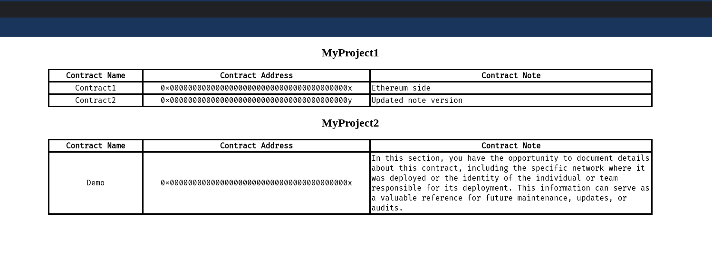

# addrbook

For developers working on smart contracts or Web3 applications, managing a multitude of smart contract addresses is a daily task. This tool simplifies the organization and management of these addresses. All data is stored locally in `~/.addrbook/data.json`, giving you full control over your information.



## Usage

Using this tool is straightforward and involves just two simple steps:

- Create a workspace.
    ```sh
    ./addrbook workspace new --name MyProject1
    ```
- Add your smart contract information to the workspace. The tool also supports updating and deleting any saved contract information.
    ```sh
    ./addrbook workspace save \
            --workspace MyProject1 \
            --contract Contract1 \
            --address 0x000000000000000000000000000000000000000x \
            --note "Ethereum side"
    ```
- Open `http://127.0.0.1:8080` with your default browser abd view your workspace.

## Run Example

1. Clone the repo.
2. Run the example script.
    ```sh
    ./example.sh
    ```
3. Open `http://127.0.0.1:8080` with your default browser, and you will see the screenshot above.